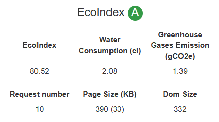
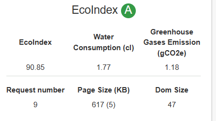

# Architecture de l'application

L'application que je propose suit une architecture client-serveur bas¨¦e sur les technologies React, Spring Boot et WebSockets.
Il y a deux branches dans gitlab, un `master` contenant le contenu de `Springboot` et un `React1` contenant le contenu de `React`.
## Sch¨¦ma de l'architecture
  ```

                      +--------------+
                      |   Navigateur |
                      +------+-------+
                             |
                             | Requ¨ºtes HTTP
                             |
                      +------+-------+
                +-----|  Serveur Web  |------+
                |     +------+-------+      |
                |            |              |
        Requ¨ºtes WebSocket   |              |
                |            |              |
                v            v              v
        +-------+-----+--------+--------+--------+
        |   React      |   Spring Boot   |   Base de donn¨¦es  |
        +--------------+-----------------+-------------------+
```

Description de l'architecture :

- Le client utilise React pour cr¨¦er une interface utilisateur r¨¦active et interactive.
- Le serveur est d¨¦velopp¨¦ avec Spring Boot, qui fournit une base solide pour la cr¨¦ation d'applications Java.
- La communication en temps r¨¦el entre le client et le serveur est ¨¦tablie ¨¤ l'aide du protocole WebSocket, permettant une exp¨¦rience de chat en temps r¨¦el fluide.

# Conception

## Diagramme de classes 

Voici le diagramme de classes repr¨¦sentant la conception de l'application :
```

               +-----------------+
               |      Canal      |
               +-----------------+
               | - id: long      |
               | - titre: String |
               | - description: String |
               | - horaire: Date |
               | - duree: int    | 
               |  - owner:int    |
               +-----------------+
                      * |
                        |                          +-----------------+
         appartenir ¨¤ ¡ü |--------------------------|    UserCanal    |           
                        |                          +-----------------+
                      * |                          |- canal: Canal   |
               +----------------+                  |- user: User     |
               |      User      |                  |                 |
               +----------------+                  +-----------------+
               | - id: long     |
               | - firstName: String |
               | - lastName: String |
               | - mail: String |
               | - password: String |
               | - admin: boolean |
               | - enabled: boolean |
               +----------------+
```
Description de la conception :

- La classe `Canal` repr¨¦sente une salle de chat, contenant les informations telles que la date de cr¨¦ation et la dur¨¦e de validit¨¦.
- La classe `User` repr¨¦sente un utilisateur du chat, contenant les informations utilisateur n¨¦cessaires.
- La classe `UserCanal` repr¨¦sente la relation entre la salle de chat et l¡¯utilisateur, la salle de chat appartenant ¨¤ l¡¯utilisateur, le membre appartenant ¨¤ la salle de chat.
# Sch¨¦ma relationnel
```
@Entity  
@Table(name = "user_canal")
 public class Usercanal {
    @Id
    @GeneratedValue(strategy = GenerationType.IDENTITY)
    private int id;

    @ManyToOne
    @JoinColumn(name = "canal_id")
    private Canal canal;

    @ManyToOne
    @JoinColumn(name = "user_id")
    private User user;
}
```
```
@Entity  
@Table(name = "canal")
public class Canal {  
    @Id  
    @GeneratedValue(strategy=GenerationType.IDENTITY)  
	private long id;  
	
	@Column(name="titre")  
	private String titre;  
	
	@Column(name="description")  
	private String description;  
	
	@Column(name="horaire")  
	private Date horaire;  
	
	@Column(name="duree")  
	private int duree;  
	
	@ManyToOne  
	@JoinColumn(name="owner")  
	private User owner;
}
```
```
@Entity  
@Table(name = "user")  
public class User {  
	@Id  
	@GeneratedValue(strategy=GenerationType.IDENTITY)
	private long id;  
  
	@Column(name = "firstname")  
	@Size(min = 2)  
	@NotEmpty(message = "firstname obligatoire")  
	private String firstName;  
    
    @Column(name = "lastname")  
	private String lastName;  
    
    @Column(name ="mail")  
	private String mail;  

	@Column(name ="password")  
	private String password;  

	@Column(name ="admin")  
	private boolean admin;  
	  
	@Column(name ="enabled")  
	private boolean enabled;
}
```

Justification des choix de conception :
- L'utilisation d'annotations JPA permet de mapper les classes sur une base de donn¨¦es relationnelle de mani¨¨re transparente. Cela simplifie les op¨¦rations de persistance des objets dans la base de donn¨¦es.
- La relation `@ManyToOne` entre `Canal` et `User` permet de repr¨¦senter la relation d'appartenance d'un utilisateur ¨¤ un canal. Ainsi, un canal peut avoir un propri¨¦taire unique, r¨¦f¨¦renc¨¦ par l'attribut `owner`.
- La classe UserCanal est utilis¨¦e pour mod¨¦liser la relation entre les utilisateurs et les canaux de chat. Elle utilise une relation @ManyToOne pour lier un utilisateur ¨¤ un canal. Cette conception permet de g¨¦rer facilement l'appartenance des utilisateurs aux canaux et d'acc¨¦der aux canaux auxquels un utilisateur est associ¨¦.

# Interactions entre les diff¨¦rentes technologies

Les interactions entre les diff¨¦rentes technologies sont les suivantes :

- React est utilis¨¦ pour la cr¨¦ation de l'interface utilisateur du client. Il offre une gestion efficace de l'¨¦tat de l'application et facilite les mises ¨¤ jour r¨¦actives de l'interface en fonction des ¨¦v¨¦nements WebSocket re?us.
- Spring Boot est utilis¨¦ pour la cr¨¦ation du serveur c?t¨¦ backend. Il g¨¨re les connexions WebSocket, g¨¨re la logique m¨¦tier et la persistance des donn¨¦es via des services et des repositories.
- Les WebSockets permettent la communication en temps r¨¦el bidirectionnelle entre le client et le serveur. Cela permet au serveur d'envoyer des mises ¨¤ jour en temps r¨¦el aux clients, tels que les nouveaux messages de chat, sans avoir besoin de recharger la page.

# R¨¦sultat eco-index de votre site
## GreenIT-Analysis
[Chrome?Web?Store - Extensions (google.com)](https://chrome.google.com/webstore/detail/greenit-analysis/mofbfhffeklkbebfclfaiifefjflcpad/related?hl=fr)
### Page de gestion des utilisateurs


### L¡¯application de chat


Pistes d'am¨¦lioration pour am¨¦liorer l'eco-index :

- Optimiser la taille des ressources statiques (images, scripts, etc.) pour r¨¦duire le temps de chargement et la consommation de bande passante.
- Mettre en cache les ressources statiques sur le client pour minimiser les requ¨ºtes r¨¦seau.
- Adopter des bonnes pratiques de programmation et de conception pour optimiser l'efficacit¨¦ du code et r¨¦duire la consommation de ressources.
- Utiliser des outils de compression et de minification pour r¨¦duire la taille des fichiers CSS et JavaScript.